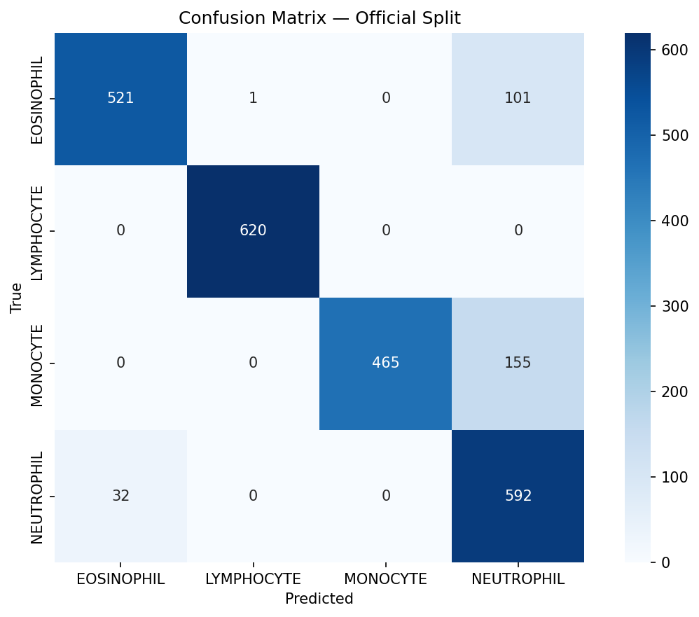
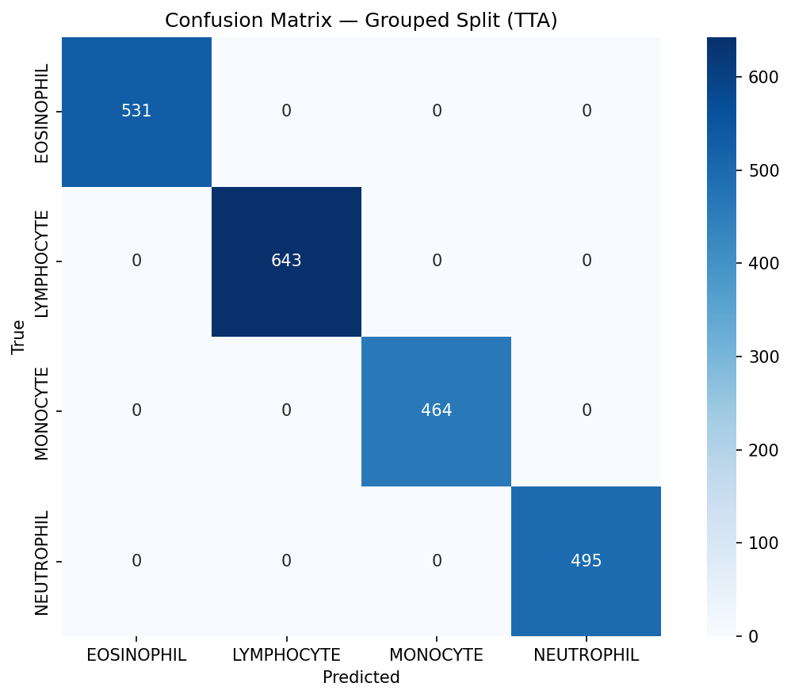

# Blood Cell Classifier — Results Report

## Model: EfficientNetV2-S

Two evaluation modes are reported:

1. **Official split** — uses dataset2's provided TRAIN/TEST split (contains data leakage)
2. **Grouped split** — group-aware split by sourceID (leakage-free, true generalization)


### Official Split

- **Checkpoint:** epoch 8, phase: finetune
- **Val macro-F1 (during training):** 1.0000

#### Standard Evaluation

- **Accuracy:** 0.8838
- **Macro-F1:** 0.8867

```
              precision    recall  f1-score   support

  EOSINOPHIL     0.9421    0.8363    0.8861       623
  LYMPHOCYTE     0.9984    1.0000    0.9992       620
    MONOCYTE     1.0000    0.7500    0.8571       620
  NEUTROPHIL     0.6981    0.9487    0.8043       624

    accuracy                         0.8838      2487
   macro avg     0.9097    0.8837    0.8867      2487
weighted avg     0.9094    0.8838    0.8866      2487

```

#### With Test-Time Augmentation (TTA)

- **Accuracy:** 0.8886
- **Macro-F1:** 0.8914

```
              precision    recall  f1-score   support

  EOSINOPHIL     0.9531    0.8475    0.8972       623
  LYMPHOCYTE     1.0000    0.9984    0.9992       620
    MONOCYTE     1.0000    0.7500    0.8571       620
  NEUTROPHIL     0.7044    0.9583    0.8119       624

    accuracy                         0.8886      2487
   macro avg     0.9144    0.8886    0.8914      2487
weighted avg     0.9141    0.8886    0.8912      2487

```




### Grouped Split

- **Checkpoint:** epoch 10, phase: finetune
- **Val macro-F1 (during training):** 1.0000

#### Standard Evaluation

- **Accuracy:** 1.0000
- **Macro-F1:** 1.0000

```
              precision    recall  f1-score   support

  EOSINOPHIL     1.0000    1.0000    1.0000       531
  LYMPHOCYTE     1.0000    1.0000    1.0000       643
    MONOCYTE     1.0000    1.0000    1.0000       464
  NEUTROPHIL     1.0000    1.0000    1.0000       495

    accuracy                         1.0000      2133
   macro avg     1.0000    1.0000    1.0000      2133
weighted avg     1.0000    1.0000    1.0000      2133

```

#### With Test-Time Augmentation (TTA)

- **Accuracy:** 1.0000
- **Macro-F1:** 1.0000

```
              precision    recall  f1-score   support

  EOSINOPHIL     1.0000    1.0000    1.0000       531
  LYMPHOCYTE     1.0000    1.0000    1.0000       643
    MONOCYTE     1.0000    1.0000    1.0000       464
  NEUTROPHIL     1.0000    1.0000    1.0000       495

    accuracy                         1.0000      2133
   macro avg     1.0000    1.0000    1.0000      2133
weighted avg     1.0000    1.0000    1.0000      2133

```





## Data Leakage Discussion

The official dataset2 TRAIN/TEST split has **100% sourceID overlap** — every TEST image is an
augmentation of a cell that also appears (in different augmented forms) in TRAIN. This means the
official split results overestimate generalization. The model partially memorizes individual cell
identity rather than purely learning cell-type morphology.

The grouped split separates by sourceID, ensuring no cell appears in more than one split.
This gives a more honest measure of how the model would perform on truly unseen cells.

Both numbers are reported for completeness — the official split for comparison with published
baselines, and the grouped split as our trusted measure of real-world performance.


## Success Criteria Assessment

| Criterion | Target | Result | Status |
|---|---|---|---|